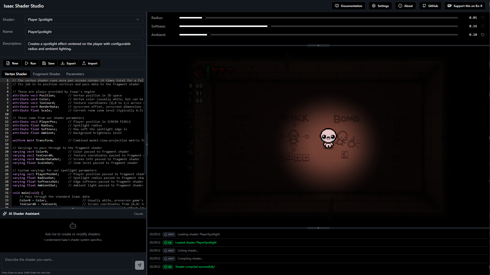

# Isaac Shader Studio

A browser-based shader editor with live preview for developing shaders for **The Binding of Isaac: Repentance**.

Write, test, and visualize your shaders in real-time with an embedded game demo that responds to your shader code instantly.



## Features

- **Live Preview** - See your shader changes instantly on a playable Isaac demo
- **Dual Editor** - Edit vertex and fragment shaders with syntax highlighting
- **GLSL Validation** - Real-time error detection with line-by-line highlighting
- **Parameter Builder** - Visual UI for defining shader parameters
- **Runtime Controls** - Adjust parameter values live while the shader runs
- **AI Assistant** - Generate and fix shaders using AI (requires API key)
- **Import/Export** - Load existing shaders or export to to a ready to run mod
- **Example Shaders** - Learn from included examples like spotlight, water, night vision, and more

## Live Demo

Try it now: **[isaac-shader-studio.sublim.nl](https://sublimnl.github.io/IsaacShaderStudio/)**

## Running Locally

### Prerequisites

- [Node.js](https://nodejs.org/) (v18 or higher)
- npm or yarn

### Installation

```bash
# Clone the repository
git clone https://github.com/sublimnl/IsaacShaderStudio.git
cd IsaacShaderStudio

# Install dependencies
npm install

# Start development server
npm run dev
```

The app will be available at `http://localhost:3000`

### Build for Production

```bash
npm run build
```

Output will be in the `dist/` folder.

## Usage

### Writing Shaders

1. Select the **Vertex** or **Fragment** tab to edit shader code
2. Use the **Attributes** tab to define parameters your shader needs
3. Click **Run** to apply changes
4. Watch the live preview update in real-time

### Parameter Types

| Type | Description |
|------|-------------|
| `float` | Single numeric value with optional min/max/step |
| `vec2`, `vec3`, `vec4` | Multi-component vectors |
| `boolean` | Toggle (renders as 0.0 or 1.0) |
| `color` | RGB color picker |
| `time` | Auto-incrementing frame counter |
| `playerpos` | Player's screen position (normalized 0-1) |
| `tearpos` | Tear positions for multi-entity effects |

### Exporting to Isaac

1. Click **Export** in the toolbar
2. Choose your export format:
   - **XML** - Single shader file for `content/shaders.xml`
   - **Lua** - Mod code to load and apply the shader
   - **Full Mod** - Complete mod package (ZIP) ready to install

## Example Shaders

The studio includes several example shaders to learn from:

- **Simple Passthrough** - Minimal shader that displays the game unmodified
- **Player Spotlight** - Darkens screen except around the player
- **Water** - Animated water reflection/refraction effect
- **Night Vision** - Green monochrome with scan lines and noise
- **Wave Distortion** - Wavy screen distortion effect
- **Censored** - Pixelation/blur effect

and more...

## AI Assistant

The AI chat can help you:
- Generate new shaders from descriptions
- Fix compilation errors automatically
- Explain shader code
- Suggest improvements

To use AI features, add your API key in **Settings** (supports OpenAI and Anthropic).

## Tech Stack

- **React 19** + TypeScript
- **Vite** for development and bundling
- **Tailwind CSS** + shadcn/ui components
- **Ace Editor** for code editing
- **@shaderfrog/glsl-parser** for GLSL validation
- **Zustand** for state management

## License

This project is licensed under **GNU General Public License v3.0**. See [LICENSE](LICENSE) for details.

## Contributing

Contributions are welcome! Feel free to:
- Report bugs or suggest features via [Issues](https://github.com/sublimnl/IsaacShaderStudio/issues)
- Submit pull requests
- Share shaders you've created

## Acknowledgments

- The Binding of Isaac is a game by Edmund McMillen and Nicalis
- This tool is a fan project and is not affiliated with or endorsed by the game developers
